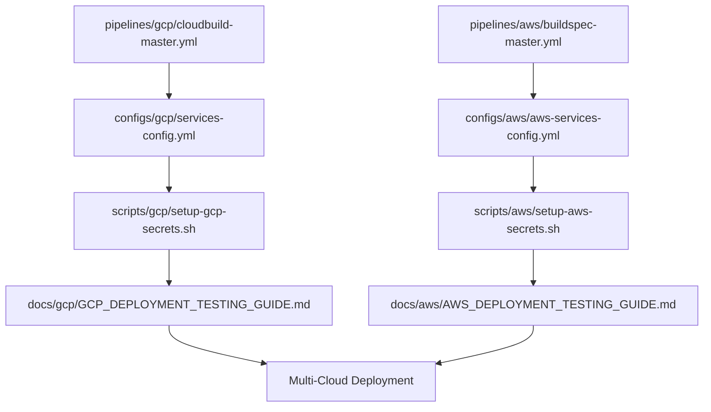

# 📁 Project Structure

## 🏗️ **Mono Repo Organization**

This project is now properly structured with cloud-specific organization for pipelines, scripts, configurations, and documentation.

```
mono-repo/
├── 📁 backend/                    # Backend services (Python)
│   └── services/
│       ├── user_service/
│       ├── notification_service/
│       └── analytics_service/
├── 📁 ui/                         # Frontend application (Angular)
├── 📁 tests/                      # Test files and configurations
├── 📁 docs/                       # Documentation organized by cloud
│   ├── 📁 gcp/                    # Google Cloud Platform docs
│   ├── 📁 aws/                    # Amazon Web Services docs
│   └── 📁 general/                # Multi-cloud and general docs
├── 📁 scripts/                    # Deployment and setup scripts
│   ├── 📁 gcp/                    # GCP-specific scripts
│   ├── 📁 aws/                    # AWS-specific scripts
│   └── 📁 general/                # General utility scripts
├── 📁 pipelines/                  # CI/CD pipeline definitions
│   ├── 📁 gcp/                    # Cloud Build pipelines
│   └── 📁 aws/                    # CodeBuild pipelines
├── 📁 configs/                    # Service configurations
│   ├── 📁 gcp/                    # GCP service configs
│   └── 📁 aws/                    # AWS service configs
├── 📁 .github/                    # GitHub Actions workflows
└── 📄 README.md                   # Main project documentation
```

---

## 📚 **Documentation Structure**

### **📁 docs/gcp/** - Google Cloud Platform
- `GCP_DEPLOYMENT_TESTING_GUIDE.md` - Complete GCP testing guide
- `GCP_ENHANCED_DEPLOYMENT_SUMMARY.md` - Enhanced deployment summary
- `GCP_PIPELINE_ANALYSIS.md` - Pipeline analysis and optimization

### **📁 docs/aws/** - Amazon Web Services
- `AWS_DEPLOYMENT_TESTING_GUIDE.md` - Complete AWS testing guide
- `AWS_DEPLOYMENT_SETUP.md` - AWS setup instructions
- `AWS_PIPELINE_CONFIGURATION_DETAILS.md` - Pipeline configuration details

### **📁 docs/general/** - Multi-Cloud & General
- `MULTI_CLOUD_COMPARISON.md` - GCP vs AWS comparison
- `DEPLOYMENT_GUIDE.md` - General deployment guide
- `CLOUD_DEPLOYMENT_SETUP.md` - Cloud setup overview
- `DYNAMIC_PIPELINE_SOLUTION.md` - Dynamic pipeline architecture
- `ENTERPRISE_DEPLOYMENT_STRATEGY.md` - Enterprise strategy
- `PROJECT_STATUS.md` - Current project status
- `SERVICE_PIPELINE_TRIGGERING.md` - Pipeline triggering guide

---

## 🔧 **Scripts Structure**

### **📁 scripts/gcp/** - GCP Scripts
- `setup-gcp-secrets.sh` - Create GCP secrets and service accounts
- `validate-gcp-prerequisites.sh` - Validate GCP environment

### **📁 scripts/aws/** - AWS Scripts
- `setup-aws-master-pipeline.sh` - Setup AWS master pipeline
- `setup-aws-secrets.sh` - Create AWS secrets and IAM resources
- `validate-aws-prerequisites.sh` - Validate AWS environment

### **📁 scripts/general/** - General Scripts
- `setup-local-dev.sh` - Local development environment setup
- `setup-master-trigger.sh` - Master pipeline trigger setup

---

## 🚀 **Pipeline Structure**

### **📁 pipelines/gcp/** - Google Cloud Build
- `cloudbuild-master.yml` - GCP master pipeline for dynamic deployment

### **📁 pipelines/aws/** - AWS CodeBuild
- `buildspec-master.yml` - AWS master pipeline for dynamic deployment

---

## ⚙️ **Configuration Structure**

### **📁 configs/gcp/** - GCP Configurations
- `services-config.yml` - GCP service definitions and settings

### **📁 configs/aws/** - AWS Configurations
- `aws-services-config.yml` - AWS service definitions and settings

---

## 🎯 **Quick Start by Cloud Provider**

### **🌐 Google Cloud Platform**
```bash
# 1. Validate prerequisites
./scripts/gcp/validate-gcp-prerequisites.sh

# 2. Setup secrets and service accounts
./scripts/gcp/setup-gcp-secrets.sh

# 3. Review documentation
docs/gcp/GCP_DEPLOYMENT_TESTING_GUIDE.md

# 4. Deploy with pipeline
# Pipeline: pipelines/gcp/cloudbuild-master.yml
# Config: configs/gcp/services-config.yml
```

### **☁️ Amazon Web Services**
```bash
# 1. Validate prerequisites
./scripts/aws/validate-aws-prerequisites.sh

# 2. Setup secrets and IAM resources
./scripts/aws/setup-aws-secrets.sh

# 3. Setup master pipeline
./scripts/aws/setup-aws-master-pipeline.sh

# 4. Review documentation
docs/aws/AWS_DEPLOYMENT_TESTING_GUIDE.md

# 5. Deploy with pipeline
# Pipeline: pipelines/aws/buildspec-master.yml
# Config: configs/aws/aws-services-config.yml
```

### **🔄 Multi-Cloud Deployment**
```bash
# 1. Setup local development
./scripts/general/setup-local-dev.sh

# 2. Review multi-cloud comparison
docs/general/MULTI_CLOUD_COMPARISON.md

# 3. Deploy to both clouds
# Follow both GCP and AWS guides above
```

---

## 📋 **File Relationships**

### **Pipeline → Config → Scripts → Docs**



---

## 🔍 **Finding What You Need**

| **I want to...** | **Go to...** |
|-------------------|--------------|
| **Deploy to GCP** | `docs/gcp/GCP_DEPLOYMENT_TESTING_GUIDE.md` |
| **Deploy to AWS** | `docs/aws/AWS_DEPLOYMENT_TESTING_GUIDE.md` |
| **Compare clouds** | `docs/general/MULTI_CLOUD_COMPARISON.md` |
| **Setup GCP secrets** | `scripts/gcp/setup-gcp-secrets.sh` |
| **Setup AWS pipeline** | `scripts/aws/setup-aws-master-pipeline.sh` |
| **Configure GCP services** | `configs/gcp/services-config.yml` |
| **Configure AWS services** | `configs/aws/aws-services-config.yml` |
| **Understand pipelines** | `pipelines/` folder |
| **Local development** | `scripts/general/setup-local-dev.sh` |
| **Project overview** | `README.md` |

---

## 🎨 **Benefits of This Structure**

1. **🎯 Cloud-Specific**: Separate folders for GCP and AWS
2. **📚 Organized Docs**: Easy to find relevant documentation
3. **🔧 Script Organization**: Scripts grouped by purpose and cloud
4. **⚙️ Config Separation**: Clear configuration management
5. **🚀 Pipeline Clarity**: Dedicated pipeline folder structure
6. **🔍 Easy Navigation**: Logical folder hierarchy
7. **📋 Clear Relationships**: Obvious file dependencies
8. **🎯 Quick Access**: Fast path to what you need

---

## 🚀 **Next Steps**

1. **Choose your cloud**: GCP or AWS (or both!)
2. **Follow the guide**: Use cloud-specific documentation
3. **Run the scripts**: Execute setup scripts in order
4. **Deploy services**: Use the master pipelines
5. **Monitor & scale**: Use cloud-native monitoring

**Your mono repo is now properly structured for enterprise-grade multi-cloud deployment!** 🌟
